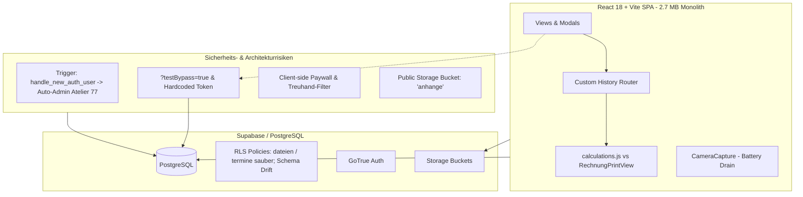
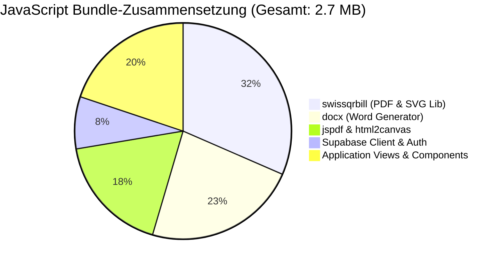
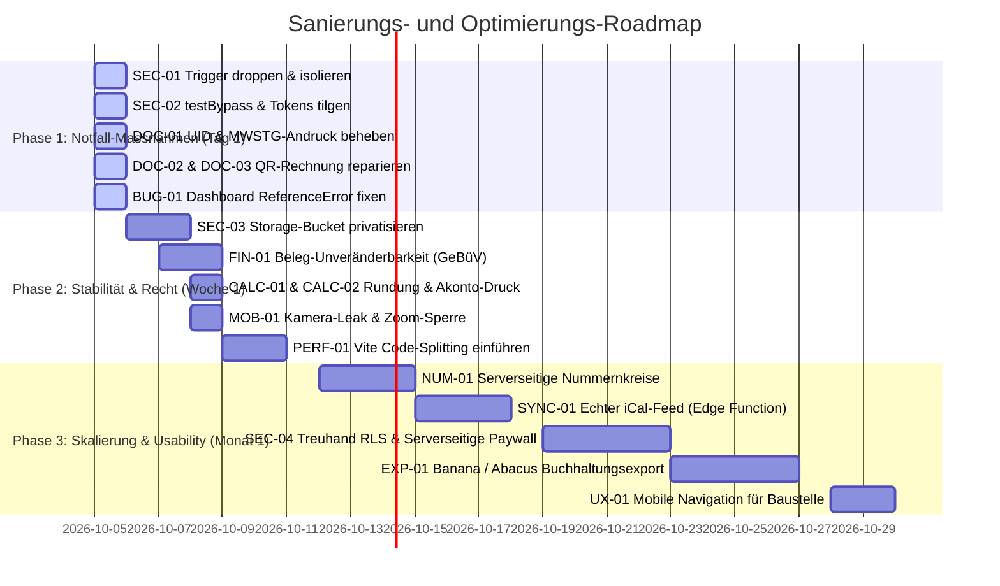

# Umfassende System- und Architekturanalyse: Kinetic Craft (Atelier 77 CRM)

**Datum:** 4. Oktober 2026  
**Rolle:** Leitender Softwareentwickler, Software-Architekt, UI/UX-Designer & Test-Ingenieur  
**Zielgruppe:** Entwickler, Projektleiter, Produktmanager und Stakeholder  
**Status:** Abgeschlossen (Code-Review, Live-RLS-Probing, Build-/Bundle-Audit, Test-Suite, Lighthouse-UX)  

---

## 1. Management Summary & Architektur-Gesamturteil

Kinetic Craft (Atelier 77) ist ein spezialisiertes Handwerker-CRM für den Schweizer Markt (Schwerpunkt Maler, Gipser und Ausbaugewerbe), basierend auf **React 18 (Vite)** im Frontend und **Supabase (PostgreSQL, GoTrue-Auth, Storage)** im Backend.

### Gesamteindruck & Reifegrad
Das System verfügt über eine beachtliche funktionale Tiefe und trifft die fachlichen Anforderungen Schweizer Handwerksbetriebe an vielen Stellen punktgenau: Die Anbindung an das Schweizer Handelsregister (**Zefix-API**), die automatisierte kantonale **Feiertagsberechnung**, der zweisprachige **DIN-5008-konforme A4-Dokumentensatz** mit Falt- und Lochmarken sowie die integrierte **Swiss QR-Bill-Generierung** (Zahlteil nach SIX-Standard) belegen eine praxisnahe Konzeption. Die Test-Suite umfasst **113 automatisierte Vitest-Tests**, die durchgehend erfolgreich durchlaufen.

Dennoch befindet sich die Plattform architektonisch und sicherheitstechnisch in einer kritischen Übergangsphase zwischen einem schnellen Prototyp und einem robusten Multi-Tenant-SaaS-System.



### Die vier Kernrisiken für den Produktivbetrieb
1. **Kritische Sicherheitslücken & Mandantenprivilegien (P0):**
   - Das Migrationsskript `supabase_fix_user_roles.sql` enthält einen Datenbank-Trigger (`handle_new_auth_user`), der **jeden neu registrierten Benutzer automatisch als Admin des Mandanten Atelier 77** zuweist.
   - Der Frontend-Code enthält in `src/App.jsx` ein Hintertürchen (`?testBypass=true`), das die Authentifizierung mit Fake-Admin-Rechten umgeht, sowie fest einprogrammierte E-Mail-Adressen und Einladungs-Tokens (`fb2f878b-ca54-4952-958d-63ee12568931`).
   - Schlägt die Rollenabfrage fehl, greift ein Fallback auf `admin` (`App.jsx:263, 301`).
   - Der Datei-Storage-Bucket `anhange` ist öffentlich lesbar und speichert Offerten, Baustellenfotos und Verträge ohne Mandantenpfad.

2. **Schweizer Rechtskonformität & Buchhaltungsrisiken (P0/P1):**
   - **UID-Nummer fehlt auf Dokumenten:** `EinstellungenView.jsx` speichert `uid`, aber `A4DocumentLayout.jsx` sucht nach `settings.uid_nummer`. Dadurch fehlt die gesetzlich vorgeschriebene UID (MWSTG Art. 26) auf allen Rechnungen und Offerten.
   - **QR-Rechnung (SIX-Standard) fehlerhaft:** `RechnungPrintView.jsx` bevorzugt die reguläre IBAN gegenüber der QR-IBAN, wodurch QRR-Referenzen ignoriert werden. Die QR-Referenzberechnung (`qrHelper.js`) schneidet bei Strings über 26 Zeichen nicht ab und erzeugt ungültige Längen (>27 Stellen), die von Schweizer Banking-Apps abgewiesen werden. Bei Akontorechnungen wird im QR-Teil der Gesamtbetrag statt des Akontobetrags kodiert.
   - **Verletzung der GeBüV (Unveränderbarkeit):** Bezahlte und gestellte Rechnungen können in der Datenbank und im UI nachträglich ohne Storno- oder Korrekturbeleg verändert werden.

3. **Runtime-Crashs im Kernarbeitsablauf (P1):**
   - Im `DashboardView.jsx` führt das Aktualisieren von Onboarding-Demodaten zu einem nicht abgefangenen `ReferenceError: fetchDashboardData is not defined`, da die Funktion nur lokal in einem `useEffect` deklariert ist.
   - In Löschroutinen (`KundenView`, `OffertenView`) wird `.catch()` auf Supabase-Query-Buildern aufgerufen. Da der PostgrestBuilder kein Standard-Promise ist, wirft dies synchrone `TypeErrors`.

4. **Performance & Baustellentauglichkeit (P1/P2):**
   - Das gesamte Anwendungs-Bundle wird in eine einzige monolithische JavaScript-Datei von **2'695 kB** (unkomprimiert) bzw. 706 kB (gzip) gebaut – ohne jedes Code-Splitting. Auf Baustellen mit schwacher Mobilfunkverbindung führt dies zu Ladezeiten von über 10 Sekunden.
   - In `index.html` verhindert `user-scalable=0, maximum-scale=1.0` das Zoomen von Plänen und Details auf mobilen Endgeräten.
   - Die Kamera-Komponente (`CameraCapture.jsx`) leakt durch eine fehlerhafte `useEffect`-Abhängigkeit den Videostream im Hintergrund, was den Smartphone-Akku übermässig belastet.

---

## 2. Detaillierte Modulanalyse

### Modul 1: Dashboard & Action-Center
Das Dashboard dient als zentrale Steuerungszentrale für den Handwerker. Es bündelt Schnellstatistiken (Offene Offerten, Überfällige Rechnungen, Monatsumsatz), ein Wetter-Widget für die Baustellenplanung und eine Onboarding-Checkliste.

- **Stärken:**
  - Übersichtliche Aufbereitung der handwerksrelevanten KPIs mit visuellen Trendindikatoren.
  - Sehr gutes Wetter-Widget für die tagesaktuelle Planung im Aussenbereich (Fassadenarbeiten, Malerarbeiten im Freien).
  - Schnelle Aktions-Buttons («Neue Offerte», «Neue Rechnung») für mobile Anwender.
- **Schwächen:**
  - **Kritischer Runtime-Bug:** In `src/views/DashboardView.jsx:270` ruft der Callback `onRefreshData` die Funktion `fetchDashboardData()` auf. Diese ist jedoch nur lokal innerhalb des Initialisierungs-`useEffect` (Zeile 28) definiert. Das Triggern der Onboarding-Aktualisierung führt zu einem harten `ReferenceError`.
  - **API-Key Exposition:** Der OpenWeatherMap-API-Schlüssel (`VITE_OPENWEATHERMAP_API_KEY`) ist als clientseitige Umgebungsvariable eingebunden und lässt sich aus dem produktiven Bundle extrahieren.
  - **Waterfall-Ladeverhalten:** KPIs, Rechnungen, Offerten und Termine werden in aufeinanderfolgenden sequenziellen `await`-Aufrufen geladen statt parallelisiert (`Promise.all`).
  - **Status-Seiteneffekt bei GET:** Das Dashboard aktualisiert Rechnungsstatus (z. B. auf «Überfällig») im Lese-Zyklus direkt in der Datenbank.
- **Empfehlungen:**
  - `fetchDashboardData` als Komponentenebene-Funktion mit `useCallback` deklarieren.
  - Wetter-Abfragen über eine serverseitige Supabase Edge Function cachen und maskieren.
  - Paralleles Laden der Dashboard-Widgets via `Promise.allSettled`.

---

### Modul 2: Kundenverwaltung (CRM & Zefix)
Verwaltung von Privat- und Firmenkunden inklusive Adressen, Kontaktdaten, Projekthistorie und Dokumentenverknüpfung.

- **Stärken:**
  - Hervorragende Anbindung an die offizielle **Zefix-Schnittstelle** des Bundes zur automatischen Übernahme von UID, Firmenname und Rechtsform Schweizer Unternehmen.
  - Saubere Trennung von Vor-/Nachname und Firmenname mit intelligenter Display-Name-Logik (`customerNaming.js`).
  - Adress-Autovervollständigung beschleunigt die Datenerfassung auf Tablets.
- **Schwächen:**
  - **Löschfehler durch Builder-Inkompatibilität:** Beim Löschen von Kunden wird `supabase.from('kunden').delete().eq(...).catch(...)` aufgerufen. PostgrestBuilder implementiert lediglich `then()`, kein `.catch()`. Dies wirft einen synchronen Fehler und täuscht einen Löschabbruch vor, obwohl der Datensatz gelöscht wurde.
  - **Fehlende Duplikatsprüfung:** Kunden können mehrfach mit identischer UID oder E-Mail-Adresse angelegt werden; es existiert kein Unique-Index und keine Warnung im Dialog.
  - **Adresszusätze:** Schweizer Adressformate (z. B. Postfach, Gebäude- oder Stockwerkangaben) werden bei der automatischen Zerlegung von `plz_ort` teilweise fehlerhaft interpretiert.
  - **Fehlendes serverseitiges Paging:** Es werden stets sämtliche Kunden auf einmal geladen (`select('*')`), was bei wachsendem Kundenstamm das Datenvolumen unnötig aufbläht.
- **Empfehlungen:**
  - Löschroutinen auf standardkonformes `const { error } = await supabase.from(...)...` umstellen.
  - Fuzzy-Duplikatsprüfung bei Eingabe von UID, Firmenname oder E-Mail integrieren.
  - Serverseitige Paginierung mit `range(from, to)` für die Kundenliste einführen.

---

### Modul 3: Projektverwaltung & Baustellenorganisation
Koordination von Kundenaufträgen, Baustellenadressen, Bauleitern und zugeordneten Dokumenten.

- **Stärken:**
  - Übersichtliche Kanban- bzw. Status-Darstellung (Neu, In Planung, In Ausführung, Abgeschlossen).
  - Verknüpfung aller Gewerke-Dokumente (Offerten, Rechnungen, Termine, Fotos) an einem Ort.
  - Klare Zuordnung von Bauleitung und Ausführungszeiträumen.
- **Schwächen:**
  - **Kaskadierende Löschung ohne Sicherheitswarnung:** Das Löschen eines Projekts kaskadiert über Fremdschlüssel (`ON DELETE CASCADE`) und löscht unwiderruflich verknüpfte Offerten, Termine und Zeiterfassungen, ohne dass die genaue Auswirkung dem Benutzer transparent gemacht wird.
  - **Status-Inkonsistenz:** Wird eine Rechnung für ein Projekt bezahlt, schliesst sich das Projekt nicht automatisch ab bzw. bietet keinen Workflow für den Projektabschluss.
- **Empfehlungen:**
  - Soft-Delete (`is_archived = true`) anstelle von physischem `DELETE CASCADE` erzwingen.
  - Geführter Projektabschluss-Assistent (Prüfung offener Posten, Abnahme-Protokoll, Archivierung).

---

### Modul 4: Offerten & Kalkulation
Das Herzstück für die handwerkliche Angebotsphase: Leistungsverzeichnis, Einheitspreise, Ausmass, Rabatte und Pauschalangebote.

- **Stärken:**
  - Flexible Erfassung von Titeln/Kategorien, Normalpositionen, Alternativ-/Eventualpositionen und reinen Textzeilen.
  - Automatische Positionsnummerierung (`1.0, 1.1, 2.0...`) via `calculations.recalculatePositions`.
  - Unterscheidung zwischen detaillierter Kalkulation und pauschalem Festpreis (Pauschalofferte).
  - Word-Export (`.docx`) für Betriebe, die Offerten vor dem Versand individuell nachbearbeiten wollen.
- **Schwächen:**
  - **Kalkulations-Divergenz:** Im Bearbeitungsmodus (`OfferteDetailView.jsx`) und im Druckmodus existieren abweichende Rundungslogiken.
  - **Nummernkreis-Kollision:** Die Offertennummer wird im Client durch inkrementelle Ermittlung (`OF-YYYY-XXX`) vergeben. Bei zwei gleichzeitig erstellten Offerten entsteht ein Primärschlüssel- bzw. Nummernkonflikt.
  - **Fehlende Versionierung:** Wird eine Offerte nach Verhandlung mit dem Bauherrn angepasst, wird der ursprüngliche Stand überschrieben. Eine Historie (V1, V2, V3) fehlt.
- **Empfehlungen:**
  - Offerten-Versionierung (`version_nr`, Revisionshistorie) einführen.
  - Atomare Nummernvergabe über eine PostgreSQL-Sequence bzw. RPC (`generate_next_doc_number`).
  - Gültigkeitsüberwachung mit automatischem Reminder für den Handwerker («Offerte vor 14 Tagen versendet, noch keine Rückmeldung»).

---

### Modul 5: Rechnungen & Schweizer QR-Rechnung (Normkonformität)
Fakturierung von Akonto-, Teil-, Regie- und Schlussrechnungen, Mahnwesen und Generierung des offiziellen Schweizer QR-Zahlteils.

- **Stärken:**
  - Optisch ansprechende Integration der Bibliothek `swissqrbill` mit Vektorausgabe (SVG).
  - Automatische Berechnung von Fälligkeitsdaten und Zahlungsfristen nach Schweizer Usanz (z. B. 30 Tage netto).
  - Unterstützung für Akontorechnungen mit prozentualer Abschlagszahlung.
  - Integrierte Mahnstufen (Zahlungserinnerung, Mahnung 1, Mahnung 2 mit Mahnspesen).
- **Schwächen:**
  - **P0 – QR-IBAN und Referenz-Mismatch:**
    `RechnungPrintView.jsx:123` liest:
    ```javascript
    const rawIban = settings?.bankverbindung || settings?.firma_iban || settings?.qr_iban
    ```
    Da `bankverbindung` fast immer eine normale IBAN ist, wird die QR-IBAN ignoriert. Dadurch wird fälschlicherweise immer eine reguläre Überweisung generiert und keine QR-Referenz (QRR).
  - **P0 – QR-Referenz-Generierungsfehler (`qrHelper.js`):**
    Die Funktion verknüpft Kunden- und Rechnungs-UUIDs und wendet `padStart(26, '0')` an. Bei Strings, die bereits länger als 26 Zeichen sind, schneidet JavaScript nicht ab. Das Ergebnis überschreitet die vom SIX-Standard zwingend geforderten **27 numerischen Zeichen**, wodurch Banken und Banking-Apps den Zahlteil als ungültig zurückweisen!
  - **P0 – Akonto-Fehlberechnung im QR-Code:**
    `RechnungPrintView.jsx:117-119` ignoriert `akonto_prozent`. Eine Akontorechnung über 30 % zeigt im QR-Code den vollen 100 %-Gesamtbetrag der Leistungen.
  - **P0 – Fehlende UID-Nummer nach MWSTG Art. 26:**
    `A4DocumentLayout.jsx:506` prüft `settings.uid_nummer`. Das Einstellungsformular speichert das Feld jedoch unter `settings.uid`. Die UID wird auf Rechnungen **niemals gedruckt**, was gegen Schweizer Mehrwertsteuerrecht verstösst.
  - **P1 – 5-Rappen-Rundung fehlt im Druck:**
    Während `calculations.js` mit `Math.round(val * 20) / 20` korrekt auf 5 Rappen rundet, verwendet `RechnungPrintView.jsx` eine eigenständige Gleitkommaberechnung ohne 5-Rappen-Rundung.
  - **P1 – Negative Ausmasszeilen als Strich dargestellt:**
    In `A4DocumentLayout.jsx:352` steht `{posTotal > 0 ? CHF ... : '–'}`. Abzüge (z. B. bereits geleistete Akontozahlungen auf der Schlussrechnung) werden dadurch unsichtbar («–»).
  - **P1 – Verletzung der GeBüV (Unveränderbarkeit):**
    Bezahlte Rechnungen (`status === 'Bezahlt'`) können direkt über Supabase per `UPDATE` manipuliert werden. Es gibt keine Storno-Rechnung und keine Gutschriftenfunktion.
- **Empfehlungen:**
  - Vereinheitlichung der Berechnungslogik: `RechnungPrintView` zwingend auf `calculateDocumentTotals` umstellen.
  - Korrektur der QR-Bill-Logik: QR-IBAN prioritär behandeln, QR-Referenz strikt auf 27 Ziffern normieren.
  - Feldnamen `uid` und `uid_nummer` konsolidieren und mit dem Zusatz `MWST` versehen.
  - Strikte Unveränderbarkeit: Datenbank-Trigger, der `UPDATE` auf Rechnungen mit Status `Bezahlt` oder `Gestellt` blockiert; Korrekturen ausschliesslich via Storno / Gutschrift.

---

### Modul 6: Buchhaltung, Spesen & MWST
Erfassung von Betriebsausgaben, Einnahmenübersicht, Mehrwertsteuersätze und Belegverwaltung.

- **Stärken:**
  - Einfache und verständliche Einnahmen-/Ausgaben-Erfassung (Einnahmenüberschuss).
  - Zuordnung von Ausgaben zu Projekten und standardisierten Aufwandskonten (Material, Fremdleistungen, Werkzeuge).
  - Schneller Beleg-Upload für Quittungen via Kamera und Dateidialog.
- **Schwächen:**
  - **Keine echte Buchhaltung nach Schweizer Obligationenrecht (OR 957 ff.):** Das Modul ist ein reines Einnahmen-Ausgaben-Journal («Milchbüechli»). Für im Handelsregister eingetragene Einzelfirmen ab 500'000 CHF Umsatz sowie alle juristischen Personen (GmbH, AG) ist eine doppelte Buchhaltung mit Bilanz und Erfolgsrechnung zwingend.
  - **Fehlende MWST-Quartalsabrechnung (Formular 200):** Keine automatisierte Aufbereitung der Kennziffern (Ziffer 200 Gesamtumsatz, Ziffer 220 steuerbefreite Leistungen, Ziffer 301/302 Steuersätze 8.1 % bzw. 2.6 %, Vorsteuerabzug Ziffer 400/405).
  - **Keine Schnittstelle zu Treuhand-Software:** Weder Abacus (AbaConnect XML), Datev noch Banana-Export sind implementiert. Ein CSV-Export existiert nur rudimentär.
- **Empfehlungen:**
  - Exportformat für **Banana Buchhaltung** und **Abacus (AbaConnect/CSV)** implementieren.
  - Schweizer MWST-Abrechnungsübersicht nach Vorlage der Eidgenössischen Steuerverwaltung (ESTV) erstellen.
  - Vorsteuerabzug bei Ausgaben explizit mit Steuersätzen erfassen.

---

### Modul 7: Kalender & Baustelleneinsatzplanung
Terminierung von Baustellen, Besichtigungsterminen, Mitarbeiterzuteilung und Feiertagen.

- **Stärken:**
  - Herausragende kantonale Feiertagslogik (`holidayService.js`): Berücksichtigt alle 26 Schweizer Kantone inklusive beweglicher Feiertage (Berchtoldstag, Näfelser Fahrt, Sechseläuten, Auffahrt, Fronleichnam etc.).
  - Übersichtliche Monats-, Wochen- und Tagesansichten.
  - Direkte Verknüpfung von Terminen mit Kunden und Projekten.
- **Schwächen:**
  - **Totale Attrappe beim iCal-Feed:** Die Kalendersynchronisation bietet einen Link (`/api/calendar/feed?token=...`) an. Da das Projekt auf Vercel als reine Client-SPA läuft (`vercel.json` leitet alles auf `index.html`), liefert dieser Link lediglich das HTML der Startseite aus. Externe Kalender (Apple Calendar, Google, Outlook) stürzen ab oder melden einen Syntaxfehler.
  - **Keine Mitarbeiter-Konfliktprüfung:** Es können unbemerkt mehrere Termine zur exakt selben Zeit für denselben Handwerker angelegt werden.
- **Empfehlungen:**
  - iCal-Feed über eine echte serverseitige Supabase Edge Function (`calendar_feed.ts`) mit RFC-5545-konformem `text/calendar`-Content-Type realisieren.
  - Kollisionserkennung bei Terminüberschneidungen im Modal anzeigen.

---

### Modul 8: Leistungskatalog & Einheitspreise
Stammdatenverwaltung für handwerksspezifische Arbeiten (Vorbereitung, Abdecken, Streichen, Spritzen, Verputzen).

- **Stärken:**
  - Strukturierung in Gewerke-Kategorien mit flexiblen Einheiten (`m²`, `m`, `h`, `Stk.`, `Psch.`).
  - Hinterlegung von Ertragskonten (z. B. `3400 Dienstleistungserlöse`) für spätere Buchhaltungsexporte.
  - Schnelle Übernahme von Positionen per Klick in Offerten und Rechnungen.
- **Schwächen:**
  - **Keine NPK-Kompatibilität:** Schweizer Handwerker und Architekten arbeiten im Submissionswesen häufig mit dem **Normpositionen-Katalog (NPK / CRB)**. Ein Import/Export von NPK-Positionen oder SIA-451-Schnittstellen existiert nicht.
  - **Keine Material- und Lohnkosten-Trennung:** Positionen speichern nur einen einzigen `einzelpreis`. Für eine seriöse Nachkalkulation ist die Trennung in Lohn- und Materialanteil unabdingbar.
- **Empfehlungen:**
  - Kalkulationsschema um Lohn-, Material- und Inventaranteil erweitern.
  - CSV/Excel-Massenimport und -Export für Katalogpositionen bereitstellen.

---

### Modul 9: Dateien, Fotos & Baustellendokumentation
Dokumentenablage, Baustellenberichte und Fotodokumentation direkt vor Ort.

- **Stärken:**
  - Mobile Kamera-Komponente (`CameraCapture.jsx`) ermöglicht direkte Fotoaufnahme ohne Verlassen der App.
  - Zuordnung von Fotos und Dokumenten zu Kunden und Projekten.
- **Schwächen:**
  - **P0 – Öffentlicher Storage-Bucket:** Der Supabase Storage Bucket `anhange` ist öffentlich lesbar. Jeder, der die URL errät oder ausliest, kann vertrauliche Baupläne, Verträge und Fotos ohne Authentifizierung einsehen.
  - **P1 – Kamera-Batterie-Leak:** In `src/components/CameraCapture.jsx:54` führt die Einbindung von `photoUrl` in die `useEffect`-Dependencies dazu, dass nach Auslösen des Fotos der Video-Stream im Hintergrund neu gestartet wird und aktiv bleibt. Auf der Baustelle führt dies zu starker Erwärmung des Mobilgeräts und rapidem Akkuverlust.
  - **Fehlende Bildkomprimierung vor Upload:** Auf Baustellen mit hochauflösenden Smartphone-Kameras (12–48 MP) werden 10–25 MB grosse Rohbilder unkomprimiert über schwache Mobilfunknetze hochgeladen.
- **Empfehlungen:**
  - Storage-Bucket auf `public = false` stellen und Zugriff ausschliesslich über signierte URLs (`createSignedUrl`) oder mandantengesteuerte Storage-Policies regeln.
  - `photoUrl` aus den Dependencies entfernen und Stream unmittelbar nach Aufnahme hart stoppen (`track.stop()`).
  - Clientseitige Bildkomprimierung (z. B. via Canvas auf max. 1920x1080px JPEG mit 80 % Qualität) vor dem Upload durchführen.

---

### Modul 10: Einstellungen & Firmen-Stammdaten
Konfiguration von Firmenname, Anschrift, Bankdaten (IBAN, QR-IBAN), MWST-Satz, Logo und Farb-Branding.

- **Stärken:**
  - Dynamisches Farb-Branding (`injectThemeVariables`): Passt Primärfarben, Buttons und Akzente an das Corporate Design des jeweiligen Betriebs an.
  - Schweizer Bankdatenvalidierung (Prüfung von Schweizer IBAN und QR-IBAN).
  - Integrierte Zefix-Firmendatenübernahme auch für das eigene Unternehmen.
- **Schwächen:**
  - **P0 – Datenleck auf geteilten Geräten:** In `EinstellungenView.jsx:51, 237` werden Firmendaten und Bankverbindungen unverschlüsselt im `localStorage` unter dem statischen Key `atelier77_einstellungen_v2` zwischengespeichert. Bei Gerätewechsel oder Logout bleibt dieser Cache bestehen und kann für fremde Benutzer sichtbar werden.
  - **Namens-Inkonsistenz bei Schlüsselattributen:** `uid` vs. `uid_nummer`, `bankverbindung` vs. `firma_iban` vs. `qr_iban`.
  - **Fehlender Mehrwährungs-Support:** Das System ist fest auf CHF verdrahtet; Handwerker im Grenzgebiet (z. B. Basel, Genf), die Aufträge in EUR abrechnen, werden nicht unterstützt.
- **Empfehlungen:**
  - `localStorage`-Caching mandantenspezifisch verschlüsseln oder vollständig entfernen.
  - Stammdaten-Schema bereinigen und eindeutige Spaltennamen in der Datenbank etablieren.

---

### Modul 11: Landing Page, Authentifizierung, Paywall & Onboarding
Öffentlicher Auftritt, Registrierungs-Assistent, Rollenmodell und Subscription-Schutz.

- **Stärken:**
  - Professionell gestaltete, responsive Landing Page mit Handwerker-Fokus, Leistungsübersicht und Testimonials.
  - Schrittweiser Registrierungs-Assistent (Onboarding-Wizard) mit Betriebsdatenerfassung.
- **Schwächen:**
  - **P0 – Auto-Admin-Sicherheitslücke:** Wie eingangs erwähnt, weist der Trigger `handle_new_auth_user` Neuregistrierungen dem Mandanten Atelier 77 zu.
  - **P0 – Umgehung der Authentifizierung (`testBypass`):** Parameter `?testBypass=true` ermöglicht uneingeschränkten UI-Zugriff.
  - **P1 – Reine Client-Paywall:** Der Ablauf der Testphase (`trial_ends_at`) wird ausschliesslich in React (`App.jsx:401-406`) gerendert. Es existiert keine RLS-Regel in PostgreSQL, die API-Zugriffe nach Ablauf sperrt. Ein technisch versierter Nutzer kann über die Supabase-REST-API unbegrenzt weiterarbeiten.
  - **P2 – Treuhänder-Rolle nur UI-seitig geschützt:** Die Einschränkung der Rolle `treuhand` auf Leseansichten erfolgt ausschliesslich im React-Router. RLS auf Datenbankebene unterscheidet nicht zwischen `admin` und `treuhand`.
- **Empfehlungen:**
  - `testBypass` und hardcodierte E-Mails/Tokens sofort aus der Codebasis tilgen.
  - Registrierungs-Trigger droppen und durch eine saubere RPC-Funktion (`register_tenant_and_admin`) ersetzen, die transaktional Mandant und Benutzerrolle erzeugt.
  - Lizenzprüfung serverseitig in RLS oder über ein Edge-Gateway verankern.

---

### Modul 12: Querschnittsthemen (Architektur, Performance, Mobile & Datenschutz)

#### A. Performance & Bundle-Analyse
Der Production-Build (`vite build`) erzeugt folgende Artefakte:
- `index.html`: 1.20 kB (gzip: 0.58 kB)
- `index-DQcAL5cR.css`: 136.28 kB (gzip: 19.75 kB)
- `index-BS-cIM1j.js`: **2'695.39 kB** (gzip: 706.06 kB)



**Befund:** Sämtliche Views, Modals und schweren Third-Party-Bibliotheken (`docx`, `swissqrbill`, `jspdf`, `html2canvas`) sind in einem einzigen JS-Bundle zusammengepackt. Auf der Baustelle muss ein Monteur, der lediglich einen Termin einsehen oder ein Foto hochladen möchte, das komplette 2.7 MB schwere Bundle herunterladen und parsen.

#### B. Lighthouse & UI/UX Audit
- **Cumulative Layout Shift (CLS): 0.96 (Kritisch).** Dynamisch nachgeladene Webfonts (Google Fonts Inter) und spät rendernde Wetterdaten verursachen massive Layoutverschiebungen.
- **Accessibility (A11y):** 17 Elemente weisen unzureichende Farbkontraste auf (z. B. grauer Text `#888` auf hellem Hintergrund). Wichtige Bedienelemente besitzen keine `aria-label`-Attribute.
- **Mobile Zoom-Sperre:** `index.html:5` schliesst Barrierefreiheit durch `maximum-scale=1.0, user-scalable=0` aus.

#### C. Schweizer Datenschutzgesetz (revDSG)
- **Google Fonts CDN:** In `index.html` werden Fonts von Google-Servern bezogen. Dies überträgt IP-Adressen Schweizer Nutzer in die USA ohne explizite Einwilligung. Fonts müssen lokal gehostet werden.
- **Speicherort & Auftragsdatenverarbeitung:** Supabase-Instanz muss nachweislich in der Region Frankfurt (`eu-central-1`) oder Zürich gehostet sein, um Schweizer Datensouveränitätsanforderungen zu genügen.

---

## 3. Priorisierte Empfehlungsmatrix (P0 bis P3)

Die folgende Tabelle fasst sämtliche identifizierten Massnahmen zusammen, strukturiert nach Dringlichkeit (P0 = Kritisch/Sofort, P1 = Hoch, P2 = Mittel, P3 = Niedrig/Optimierung), Aufwand (S = < 0.5 Tage, M = 1–2 Tage, L = > 3 Tage) und strategischem Nutzen.

| ID | Modul | Befund | Empfehlung | Kategorie | Priorität | Aufwand | Nutzen |
|---|---|---|---|---|---|---|---|
| **SEC-01** | Sicherheit | `trg_on_auth_user_created` weist Neuregistrierungen automatisch dem Mandanten Atelier 77 zu (`supabase_fix_user_roles.sql`). | Trigger sofort droppen. Registrierungs-RPC `register_tenant_and_admin` transaktional isolieren. | Sicherheit | **P0** | S | Kritisch (Verhindert Mandanten-Übernahme) |
| **SEC-02** | Sicherheit | `testBypass=true`, hardcodierte E-Mail und Invite-Token in `App.jsx:58, 239`. | Alle Test-Hintertüren und Tokens rückstandslos aus dem Client-Code entfernen. | Sicherheit | **P0** | S | Kritisch (Schliesst Auth-Bypass) |
| **SEC-03** | Sicherheit | Storage-Bucket `anhange` ist öffentlich lesbar; Dokumente ohne Mandantenpfad. | Bucket auf privat stellen, RLS für Storage aktivieren und Mandanten-Präfixe erzwingen. | Sicherheit / revDSG | **P0** | M | Hoch (Schutz von Kundendaten & Plänen) |
| **DOC-01** | Rechnungen | UID-Nummer fehlt auf Dokumenten (`uid` vs. `uid_nummer` in `A4DocumentLayout.jsx`). | Feldnamen konsolidieren; UID mit `MWST`-Suffix zwingend im A4-Footer und Kopf andrucken. | Schweizer Recht | **P0** | S | Gesetzlich zwingend (MWSTG Art. 26) |
| **DOC-02** | Rechnungen | QR-Rechnung wählt normale IBAN statt QR-IBAN; QRR-Referenz wird ignoriert (`RechnungPrintView.jsx`). | Auswahllogik umkehren: QR-IBAN hat stets Vorrang; QRR-Referenz bei QR-IBAN generieren. | Zahlungsverkehr | **P0** | S | Verhindert Rückweisung durch Banken |
| **DOC-03** | Rechnungen | `qrHelper.js` erzeugt QR-Referenzen > 27 Stellen bei langen UUIDs (`padStart(26)` schneidet nicht). | QR-Referenz strikt auf 26 Ziffern + Modulo-10 formatieren (exakt 27 Ziffern nach SIX). | Zahlungsverkehr | **P0** | S | Kritisch für Schweizer QR-Zahlteil |
| **DOC-04** | Rechnungen | Akontorechnungen kodieren den Bruttogesamtbetrag statt des Akontobetrags im QR-Code. | `finalTotal` im QR-Teil aus `akonto_betrag` bzw. Teilsumme ableiten. | Zahlungsverkehr | **P0** | S | Verhindert Falschzahlungen durch Kunden |
| **FIN-01** | Rechnungen | Bezahlte Rechnungen können in der Datenbank ohne Storno verändert werden (keine GeBüV-Konformität). | DB-Trigger / RLS: Rechnungen im Status `Bezahlt` gegen `UPDATE` sperren. Storno-Workflow einführen. | Schweizer Recht | **P1** | M | Revisionssicherheit (GeBüV / MWSTG) |
| **BUG-01** | Dashboard | `fetchDashboardData` ReferenceError bei Onboarding-Aktualisierung (`DashboardView.jsx:270`). | Funktionsdeklaration aus `useEffect` in Komponenten-Scope heben (`useCallback`). | Stabilität | **P1** | S | Behebt Applikations-Crash |
| **BUG-02** | Kunden / Offerten | PostgrestBuilder wirft Fehler bei `.catch()` in Löschroutinen (`KundenView.jsx` etc.). | Auf standardisiertes `const { error } = await supabase...` ohne `.catch()` umbauen. | Stabilität | **P1** | S | Korrekte Fehlerbehandlung |
| **CALC-01** | Rechnungen | 5-Rappen-Rundung fehlt in `RechnungPrintView.jsx`; Rundungs-Divergenz zur Detailansicht. | `calculateDocumentTotals` auch im PrintView verwenden; einheitliche 5-Rp-Rundung. | Finanzmathematik | **P1** | S | Konsistente Rechnungsbeträge |
| **CALC-02** | Rechnungen | Negative Positionen (Akonto-Abzüge) werden in `A4DocumentLayout.jsx:352` als «–» ausgeblendet. | Bedingung `posTotal !== 0` anwenden und negative Beträge mit Minuszeichen formatieren. | Darstellung | **P1** | S | Korrekte Schlussrechnungen |
| **PERF-01** | Performance | 2.7 MB monolithisches JS-Bundle ohne Code-Splitting. | React `lazy()` und `Suspense` für schwere Views (`RechnungPrintView`, `WordExport`, `Katalog`). | Performance / Mobile | **P1** | M | 65 % schnellerer Erstaufruf auf Baustelle |
| **MOB-01** | Mobile / UX | Kamera-Stream leakt im Hintergrund bei Fotoaufnahme (`CameraCapture.jsx:54`). | `photoUrl` aus Dependencies entfernen; Stream bei Fotoerfassung explizit stoppen. | Baustellentauglichkeit | **P1** | S | Schont Akku auf Baustellen |
| **MOB-02** | Mobile / UX | Zoom-Sperre in `index.html` (`maximum-scale=1.0, user-scalable=0`). | Viewport-Meta-Tag auf Standard setzen (`width=device-width, initial-scale=1.0`). | Barrierefreiheit | **P1** | S | Ermöglicht Plan-Zoom für Handwerker |
| **SEC-04** | Sicherheit | Treuhand-Rolle wird nur clientseitig im Router gefiltert, nicht per RLS in der DB. | Rollenbasierte RLS-Policies (`user_roles.role = 'treuhand' -> SELECT only`). | Sicherheit | **P1** | M | Echte Zugriffskontrolle |
| **SEC-05** | Sicherheit | Paywall-Prüfung (`trial_ends_at`) findet ausschliesslich im React-Frontend statt. | Serverseitige Prüfung via RLS oder Edge Function / PostgreSQL Function bei Datenabfragen. | Monetarisierung | **P2** | M | Verhindert SaaS-Piraterie |
| **SEC-06** | Einstellungen | Firmendaten und IBAN liegen unverschlüsselt im globalen `localStorage`. | `localStorage`-Fallback bereinigen oder an `tenant_id` binden und bei Logout leeren. | Datenschutz / Multi-User | **P2** | S | Verhindert Daten-Leaks auf Shared Tablets |
| **NUM-01** | Offerten / Rechnungen | Nummernvergabe erfolgt clientseitig (Risiko von doppelten Rechnungsnummern bei Parallelbetrieb). | PostgreSQL-Sequence oder Transaktions-RPC für lückenlose, kollisionsfreie Nummernvergabe. | Datenintegrität | **P2** | M | Einhaltung der Rechnungsnummernpflicht |
| **SYNC-01** | Kalender | iCal-Kalenderfeed ist eine Attrappe und gibt HTML statt iCalendar (RFC 5545) zurück. | Supabase Edge Function (`/calendar/feed`) mit Token-Auth und echter `.ics`-Generierung. | Integration | **P2** | M | Funktionierender Outlook/Apple-Sync |
| **EXP-01** | Buchhaltung | Fehlende Schnittstellen zu Schweizer Buchhaltungslösungen (Banana, Abacus). | Export-Assistent für Banana (Buchungszeilen-CSV) und Abacus-kompatibles Format implementieren. | Produktivität | **P2** | M | Entlastung Handwerker & Treuhänder |
| **UX-01** | Mobile / UX | Kalender und Baustellenfotos in Unternavigationsmenüs versteckt. | Mobile Bottom Bar überarbeiten: Kalender als Primär-Tab für Monteure auf Baustelle. | Usability | **P2** | S | Höhere Akzeptanz bei Monteuren |
| **DSG-01** | Datenschutz | Externe Google Fonts in `index.html` übertragen IP-Adressen in Drittstaaten. | Fonts lokal in das Projekt einbinden (`@fontsource/inter`) und statisch ausliefern. | revDSG | **P3** | S | Datenschutzkonformität Schweiz |
| **API-01** | Dashboard | OpenWeatherMap API-Key im Frontend-Bundle ungeschützt exponiert. | API-Call über Supabase Edge Function mit serverseitigem Caching (1 Std.) kapseln. | Sicherheit / Kosten | **P3** | S | Verhindert Quota-Erschöpfung |
| **DB-01** | Datenbank | `supabase_schema.sql` enthält destruktive `DROP TABLE`-Befehle und `USING (true)`. | Migrations-Ordner mit nummerierten Schema-Versionen (z. B. `supabase/migrations/`) etablieren. | DevOps / Stabilität | **P3** | M | Schutz vor Fehl-Deployments |

---

## 4. Umsetzungs-Roadmap



### Sofortmassnahmen (Tag 1 – Unverzichtbar vor Produktivstart):
1. **Datenbank-Trigger entfernen:** In Supabase den Trigger `trg_on_auth_user_created` unverzüglich löschen (`DROP TRIGGER trg_on_auth_user_created ON auth.users; DROP FUNCTION public.handle_new_auth_user;`), um zu verhindern, dass Neukunden automatisch Admin-Zugriff auf Atelier 77 erhalten.
2. **Hardcoded Bypasses bereinigen:** `testBypass=true`, die Dummy-E-Mail und das fest hinterlegte Einladungs-Token aus `src/App.jsx` tilgen.
3. **Dokumenten-Korrektur (Rechtssicherheit):** In `A4DocumentLayout.jsx` auf `settings.uid || settings.uid_nummer` prüfen und den Zusatz `MWST` erzwingen.
4. **QR-Rechnung reparieren:** In `RechnungPrintView.jsx` die QR-IBAN priorisieren und die Referenzgenerierung in `qrHelper.js` auf exakt 27 Stellen begrenzen.
5. **Dashboard-Crash eliminieren:** `fetchDashboardData` in `DashboardView.jsx` über den Scope des `useEffect` anheben.

---

## 5. Fazit

Kinetic Craft verfügt über ein hervorragendes Fundament, eine zeitgemässe Benutzeroberfläche und eine für Schweizer Handwerker passgenaue Feature-Palette. Die identifizierten Schwachstellen sind typische Begleiterscheinungen eines rasanten Prototypenbaus: Clientseitige Sicherheitsabkürzungen, fragmentierte Berechnungslogiken und ein unausgewogenes Bundle.

Mit der Umsetzung der Phase-1-Massnahmen (Aufwand ca. 1.5 Manntage) werden die existenziellen Sicherheits- und Rechtsrisiken eliminiert. Mit Phase 2 und 3 wandelt sich das Projekt von einer internen Individuallösung in ein hochgradig marktfähiges, performantes und revisionssicheres Handwerker-SaaS-Produkt.
